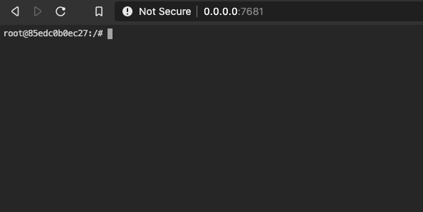
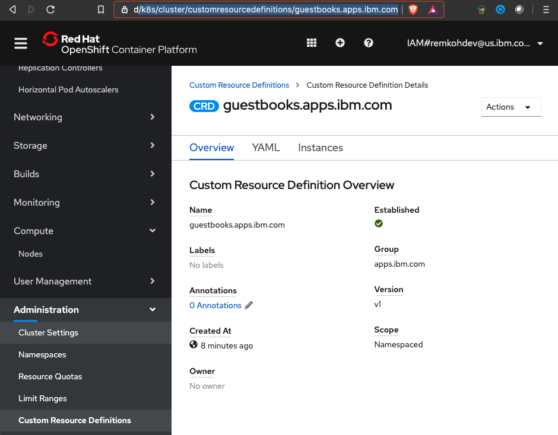
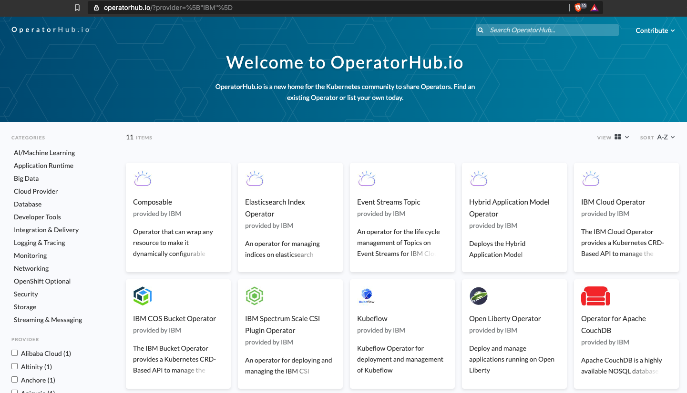
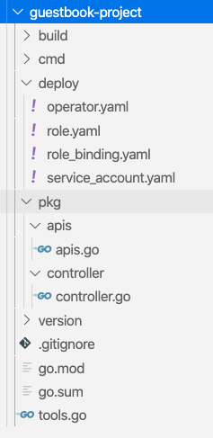
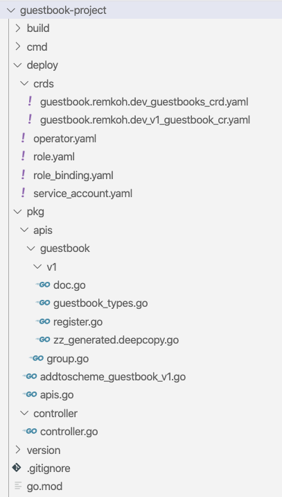

# Kubernetes Extensions

- Access the web-terminal
- Login 
- Create a Custom Resource
- Operators
  - Ready Made Operators
- Create a Custom Resource and Operator using the Operator SDK
    - Install sdk-operator
    - Create the Operator
    - Cleanup
- Application CRD

## Access the web-terminal

When running the lab for Kubernetes Extensions, you can make use of a web-terminal. The Dockerfile to use is located in https://github.com/IBMAppModernization/web-terminal, and named [Dockerfile-s2i-oc-tekton-operator](https://github.com/IBMAppModernization/web-terminal/blob/master/Dockerfile-s2i-oc-tekton-operator).

To run on localhost as a Docker container,
```
git clone https://github.com/IBMAppModernization/web-terminal.git
cd web-terminal
docker build --no-cache -t web-terminal:latest -f Dockerfile-s2i-oc-tekton-operator .
docker run -d --restart always --name terminal -p 7681:7681 -v $HOME/dev/tmp:/root/dev web-terminal
docker ps -a
CONTAINER ID    IMAGE    COMMAND    CREATED    STATUS    PORTS    NAMES
85edc0b0ec27    web-terminal    "ttyd -p 7681 bash"    17 minutes ago    Up 17 minutes    0.0.0.0:7681->7681/tcp   terminal
```

The volume mapping will write all files under the working directory to the host directory `$HOME/dev/tmp`. So suppose my host's user home directory is `/Users/remkohdev@us.ibm.com/`. If I open the terminal in the browser, the working directory for the user is `/root`. Any file that is created under `/root` is created on the host's directory `$HOME/dev/tmp`. Similarly if I create a file in `$HOME/dev/tmp` it is available in the container's `/root` directory.

Open the web-terminal in a browser and go to http://0.0.0.0:7681.



If Go, Operator SDK

## Login

```
export CLUSTERNAME=remkohdev-roks-labs-3n-cluster
ibmcloud login 
```

Go to the OpenShift web console
Copy Login command
```
oc login --token=_12AbcD345kIPDIRg2jYpCuZ-g5SM5Im9irY2tol4Q8 --server=https://c100-e.us-south.containers.cloud.ibm.com:30712
```

## Create a Custom Resource (CR)

https://kubernetes.io/docs/tasks/extend-kubernetes/custom-resources/custom-resource-definitions/

Custom Resource Definitions (CRD) were added in Kubernetes v1.7 in June 2017. A CRD defines Custom Resources (CR). A CR is an extension of the Kubernetes API that allows you to store your own API Objects and lets the API Server handle the lifecycle of a CR. On their own, CRs simply let you store and retrieve structured data.

For instance, our Guestbook application consists of an object `Guestbook` with attributes `GuestbookTitle` and `GuestbookSubtitle`, and a Guestbook handles objectes of type `GuestbookMessage` with attributes `Message`, `Sender`. 

You have to ask yourself if it makes sense if your objects are added as a Custom Resource to Kubernetes or not. If your API is a [Declarative API](https://kubernetes.io/docs/concepts/extend-kubernetes/api-extension/custom-resources/#declarative-apis) you can consider adding a CR. 

- Your API has a small number of small objects (resources).
- The objects define configuration of applications or infrastructure.
- The objects are updated relatively infrequently.
- Users often need to read and write the objects.
- main operations on the objects are CRUD (create, read, update and delete).
- Transactions between objects are not required.

It doesn't immediately make sense to store messages by Guestbook users in Kubernetes, but it might make sense to store meta-data about a Guestbook deployment, for instance the title and subtitle of a Guestbook deployment, assigned resources or replicas.

Another benefit of adding a Custom Resource is to view your types in the Kubernetes Dashboard.

If you want to deploy a Guestbook instance as a Kubernetes API object and let the Kubernetes API Server handle the lifecycle events of the Guestbook deployment, you can create a Custom Resource Definition (CRD) for the Guestbook object as follows. That way you can deploy multiple Guestbooks with different titles and let each be managed by Kubernetes.

```
cat <<EOF >>guestbook-crd.yaml
apiVersion: apiextensions.k8s.io/v1
kind: CustomResourceDefinition
metadata:
  name: guestbooks.apps.ibm.com
spec:
  group: apps.ibm.com
  versions:
    - name: v1
      served: true
      storage: true
      schema:
        openAPIV3Schema:
          type: object
          properties:
            spec:
              type: object
              properties:
                guestbookTitle:
                  type: string
                guestbookSubtitle:
                  type: string
  scope: Namespaced
  names:
    plural: guestbooks
    singular: guestbook
    kind: Guestbook
    shortNames:
    - gb
EOF
```

- You can see that the `apiVersion` is part of the `apiextensions.k8s.io/v1` API Group in Kubernetes, which is the API that enables extensions, and the `kind` is set to `CustomResourceDefinition`.
- The `served` flag can disable and enable a version.
- Only 1 version can be flagged as the storage version.
- The `spec.names.kind` is used by your resource manifests and should be CamelCased.

Create the Custom Resource for the Guestbook witht he command,

```
oc create -f guestbook-crd.yaml
```

When run in the terminal,
```
$ oc create -f guestbook-crd.yaml
customresourcedefinition.apiextensions.k8s.io/guestbooks.apps.ibm.com created
```

You have now added a CR to the Kubernetes API, but you have not yet created a deployment of type Guestbook yet.

Create a resource specification of type Guestbook named `my-guestbook`,

```
cat <<EOF >>my-guestbook.yaml
apiVersion: "apps.ibm.com/v1"
kind: Guestbook
metadata:
  name: my-guestbook
spec:
  guestbookTitle: "The Chemical Wedding of Remko"
  guestbookSubtitle: "First Day of Many"
EOF
```

And to create the `my-guestbook` resource, run the command

```
oc create -f my-guestbook.yaml
```

When run in the terminal,
```
$ oc create -f my-guestbook.yaml
guestbook.apps.ibm.com/my-guestbook created
```

If you list all Kubernetes resources, only the default Kubernetes service is listed. To list your Custom Resources, add the extended type to your command.

```
$ oc get all
NAME    TYPE    CLUSTER-IP    EXTERNAL-IP    PORT(S)    AGE
service/kubernetes    ClusterIP    172.21.0.1    <none>    443/TCP    5d14h
service/openshift    ExternalName    <none>    kubernetes.default.svc.cluster.local    <none>    5d14h
service/openshift-apiserver    ClusterIP    172.21.6.8    <none>    =443/TCP    5d14h

$ oc get guestbook 
NAME    AGE
my-guestbook    8m32s
```

To read the details for the `my-guestbook` of type `Guestbook`, describe the instance,

```
$ oc describe guestbook my-guestbook

Name:         my-guestbook
Namespace:    default
Labels:       <none>
Annotations:  <none>
API Version:  apps.ibm.com/v1
Kind:         Guestbook
Metadata:
  Creation Timestamp:  2020-06-30T20:31:36Z
  Generation:          1
  Resource Version:    1081471
  Self Link:           /apis/apps.ibm.com/v1/namespaces/default/guestbooks/my-guestbook
  UID:                 dcbdcafc-999d-4051-9244-0315093357e7
Spec:
  Guestbook Subtitle:  First Day of Many
  Guestbook Title:     The Chemical Wedding of Remko
Events:                <none>
```

Or retrieve the resource information by specifying the type,

```
$ oc get Guestbook -o yaml
apiVersion: v1
items:
- apiVersion: apps.ibm.com/v1
  kind: Guestbook
  metadata:
    creationTimestamp: "2020-07-02T04:41:57Z"
    generation: 1
    name: my-guestbook
    namespace: default
    resourceVersion: "1903244"
    selfLink: /apis/apps.ibm.com/v1/namespaces/default/guestbooks/my-guestbook
    uid: 3f774899-3070-4e00-b74c-a6a14654faeb
  spec:
    guestbookSubtitle: First Day of Many
    guestbookTitle: The Chemical Wedding of Remko
kind: List
metadata:
  resourceVersion: ""
  selfLink: ""
```

In the OpenShift web console, you can browse to Administration > Custom Resource Definitions and find the Guestbook CRD at `/k8s/cluster/customresourcedefinitions/guestbooks.apps.ibm.com`.



You have now created a new type or Custom Resource (CR) and created an instance of your new type. But just having a new type and a new instance of the type, does not add as much control over the instances yet, we can basically only create and delete a static type with some descriptive meta-data. With a custom controller or `Operator` you can over-write the methods that are triggered at certain lifecycle events.


## Operators

https://kubernetes.io/docs/concepts/extend-kubernetes/operator/

Operators are clients of the Kubernetes API that act as controllers for a Custom Resource. 

To write applications that use the Kubernetes REST API, you can use one of the following supported client libraries:
- [Go](github.com/kubernetes/client-go/),
- [Python](github.com/kubernetes-client/python/),
- [Java](github.com/kubernetes-client/java),
- [CSharp dotnet](github.com/kubernetes-client/csharp),
- [JavaScript](github.com/kubernetes-client/javascript),
- [Haskell](github.com/kubernetes-client/haskell).

In addition, there are many community-maintained [client libraries](https://kubernetes.io/docs/reference/using-api/client-libraries/).


### Ready made operators

At the [OperatorHub.io](https://operatorhub.io/), you find ready to use operators written by the community.



## Create a Custom Resource and Operator using the Operator SDK

To write your own operator you can use existing tools:
- [KUDO](https://kudo.dev/) (Kubernetes Universal Declarative Operator),
- [kubebuilder](https://book.kubebuilder.io/),
- [Metacontroller](https://metacontroller.app/) using custom WebHooks,
- the [Operator Framework](https://github.com/operator-framework/getting-started).


The Operator SDK provides the following workflow to develop a new Operator:

The following workflow is for a new Go operator:

1. Create a new operator project using the SDK Command Line Interface(CLI)
2. Define new resource APIs by adding Custom Resource Definitions(CRD)
3. Define Controllers to watch and reconcile resources
4. Write the reconciling logic for your Controller using the SDK and controller-runtime APIs
5. Use the SDK CLI to build and generate the operator deployment manifests


### Install sdk-operator

For detailed installation instructions go [here](https://sdk.operatorframework.io/docs/install-operator-sdk/).

To install the Operator SDK in Ubuntu, you need to install the Go tools and the Operator SDK.

```
$ curl -LO https://golang.org/dl/go1.14.4.linux-amd64.tar.gz 
$ tar -C /usr/local -xzf go1.14.4.linux-amd64.tar.gz 
$ export PATH=$PATH:/usr/local/go/bin

$ curl -LO https://github.com/operator-framework/operator-sdk/releases/download/v0.18.2/operator-sdk-v0.18.2-x86_64-linux-gnu 
$ chmod +x operator-sdk-v0.18.2-x86_64-linux-gnu 
$ sudo mkdir -p /usr/local/bin/ 
$ sudo cp operator-sdk-v0.18.2-x86_64-linux-gnu /usr/local/bin/operator-sdk 
$ rm operator-sdk-v0.18.2-x86_64-linux-gnu

$ go version
$ operator-sdk version
```

### Create the Operator 

#### 1. Create a New Project

Create a [new Operator](https://docs.openshift.com/container-platform/4.3/operators/operator_sdk/osdk-cli-reference.html#osdk-cli-reference-new_osdk-cli-reference) project,

```
$ export DOCKER_USERNAME=<your-docker-username>

$ export OPERATOR_NAME=guestbook-operator
$ export OPERATOR_PROJECT=guestbook-project
$ export OPERATOR_GROUP=guestbook.remkoh.dev
$ export OPERATOR_VERSION=v1
$ export CRD_KIND=Guestbook

$ go version
$ operator-sdk version

$ operator-sdk new $OPERATOR_PROJECT --type go --repo github.com/$DOCKER_USERNAME/$OPERATOR_NAME

$ cd $OPERATOR_PROJECT
```

The scaffolding of a new project will create an operator, an api and a controller.



#### 2. Create a new API 

Add a new API definition for a new Custom Resource under `pkg/apis` and generate the Custom Resource Definition (CRD) and Custom Resource (CR) files under `deploy/crds`.

```
$ operator-sdk add api --api-version=$OPERATOR_GROUP/$OPERATOR_VERSION --kind=$CRD_KIND
```

The command will create a new API, a Custom Resource (CR), a Custom Resource Definition (CRD).



One file is created in `pkg/apis` called `addtoscheme_guestbook_v1.go` that registers the new schema. One new file is created in `pkg/apis/guestbook` called `group.go` that defines the package. Four new files are created in `pkg/apis/guestbook/v1`:
- doc.go,
- guestbook_types.go,
- register.go,
- zz_generated.deepcopy.go.

The `guestbook_types.go` file,

```
package v1

import (
	metav1 "k8s.io/apimachinery/pkg/apis/meta/v1"
)

// GuestbookSpec defines the desired state of Guestbook
type GuestbookSpec struct {
}

// GuestbookStatus defines the observed state of Guestbook
type GuestbookStatus struct {
}

type Guestbook struct {
	metav1.TypeMeta   `json:",inline"`
	metav1.ObjectMeta `json:"metadata,omitempty"`

	Spec   GuestbookSpec   `json:"spec,omitempty"`
	Status GuestbookStatus `json:"status,omitempty"`
}

// GuestbookList contains a list of Guestbook
type GuestbookList struct {
	metav1.TypeMeta `json:",inline"`
	metav1.ListMeta `json:"metadata,omitempty"`
	Items           []Guestbook `json:"items"`
}

func init() {
	SchemeBuilder.Register(&Guestbook{}, &GuestbookList{})
}
```

The Custom Resource (CR) in file `deploy/crds/guestbook.remkoh.dev_v1_guestbook_cr`,
```
apiVersion: guestbook.remkoh.dev/v1
kind: Guestbook
metadata:
  name: example-guestbook
spec:
  # Add fields here
  size: 3
```

The Custom Resource Definition (CRD) in file `deploy/crds/guestbook.remkoh.dev_guestbooks_crd.yaml`,
```
apiVersion: apiextensions.k8s.io/v1
kind: CustomResourceDefinition
metadata:
  name: guestbooks.guestbook.remkoh.dev
spec:
  group: guestbook.remkoh.dev
  names:
    kind: Guestbook
    listKind: GuestbookList
    plural: guestbooks
    singular: guestbook
  scope: Namespaced
  versions:
  - name: v1
    schema:
      openAPIV3Schema:
        description: Guestbook is the Schema for the guestbooks API
        properties:
          apiVersion:
            description: 'APIVersion defines the versioned schema of this representation
              of an object. Servers should convert recognized schemas to the latest
              internal value, and may reject unrecognized values. More info: https://git.k8s.io/community/contributors/devel/sig-architecture/api-conventions.md#resources'
            type: string
          kind:
            description: 'Kind is a string value representing the REST resource this
              object represents. Servers may infer this from the endpoint the client
              submits requests to. Cannot be updated. In CamelCase. More info: https://git.k8s.io/community/contributors/devel/sig-architecture/api-conventions.md#types-kinds'
            type: string
          metadata:
            type: object
          spec:
            description: GuestbookSpec defines the desired state of Guestbook
            type: object
          status:
            description: GuestbookStatus defines the observed state of Guestbook
            type: object
        type: object
    served: true
    storage: true
    subresources:
      status: {}
```

#### 3. Create a new Controller

Add a new controller under `pkg/controller/<kind>`. 

```
$ operator-sdk add controller --api-version=$OPERATOR_GROUP/$OPERATOR_VERSION --kind=$CRD_KIND
```

This command creates two files in `pkg/controller`:
- `add_guestbook.go`, which registers the new controller, and
- `guestbook/guestbook_controller.go`, which is the actual custom controller logic.

The file `guestbook/guestbook_controller.go` defines the `Reconcile` function,

```
// Reconcile reads state of the cluster for a Guestbook object and makes changes based on the state read and what is in the Guestbook.Spec
// TODO(user): User must modify this Reconcile function to implement their own Controller logic.  This example creates a Pod as an example
func (r *ReconcileGuestbook) Reconcile(request reconcile.Request) (reconcile.Result, error) {
    ...
    // Fetch the Guestbook instance
	instance := &guestbookv1.Guestbook{}
    ...
    // Define a new Pod object
	pod := newPodForCR(instance)
    ...
}
```

#### 4. Compile and Build the Code

The operator-sdk build command compiles the code and builds the executables. fter you built the image, push it to your image registry, e.g. Docker hub.

```
$ operator-sdk build docker.io/$DOCKER_USERNAME/$OPERATOR_NAME
$ docker login docker.io -u $DOCKER_USERNAME
$ docker push docker.io/$DOCKER_USERNAME/$OPERATOR_NAME
```

#### 5. Deploy the Operator

First replace the image attribute in the operator resource with the built image,

```
$ sed -i "s|REPLACE_IMAGE|docker.io/$DOCKER_USERNAME/$OPERATOR_NAME|g" deploy/operator.yaml
```

Make sure you are connected to the OpenShift cluster (see above how to connect), and deploy the operator with the following template code.

```
$ oc create sa $OPERATOR_PROJECT
$ oc create -f deploy/role.yaml
$ oc create -f deploy/role_binding.yaml
$ oc create -f deploy/crds/${OPERATOR_GROUP}_${CRD_KIND,,}s_crd.yaml
$ oc create -f deploy/operator.yaml
$ oc create -f deploy/crds/${OPERATOR_GROUP}_${OPERATOR_VERSION}_${CRD_KIND,,}_cr.yaml
$ oc get deployment $OPERATOR_PROJECT
$ oc get pod -l app=example-${CRD_KIND,,}
$ oc describe ${CRD_KIND,,}s.${OPERATOR_GROUP} example-${CRD_KIND,,}
```

For our example Guestbook project the above templates should resolve as follows,

```
$ oc create sa guestbook-project
$ oc create -f deploy/role.yaml
$ oc create -f deploy/role_binding.yaml
$ oc create -f deploy/crds/guestbook.remkoh.dev_guestbooks_crd.yaml
$ oc create -f deploy/operator.yaml
$ oc create -f deploy/crds/guestbook.remkoh.dev_v1_guestbook_cr.yaml
$ oc get deployment guestbook-project
$ oc get pod -l app=example-guestbook
$ oc describe guestbooks.guestbook.remkoh.dev example-guestbook
```

### Cleanup

```
$ oc delete sa $OPERATOR_PROJECT
$ oc delete role $OPERATOR_PROJECT
$ oc delete rolebinding $OPERATOR_PROJECT
$ oc delete customresourcedefinition ${CRD_KIND,,}s.${OPERATOR_GROUP}
$ oc delete deployment $OPERATOR_PROJECT
```

## Application CRD

The [Application CRD (Custom Resource Definition)](https://github.com/kubernetes-sigs/application) and Controller provide the following:
- Describe an applications metadata,
- A point to connect the infrastructure, such as Deployments, to as a root object.
- 
- Application level health checks.

This could be used by:
- Application operators,
- Tools, such as Helm, and
- Dashboards.

```
apiVersion: app.k8s.io/v1beta1
kind: Application
metadata:
  name: "guestbook"
  labels:
    app.kubernetes.io/name: "guestbook"
spec:
  selector:
    matchLabels:
     app.kubernetes.io/name: "guestbook"
  componentKinds:
    - group: v1
      kind: Deployment
    - group: v1
      kind: Service
  descriptor:
    type: "guestbook"
    keywords:
      - "gb"
      - "guestbook"
    links:
      - description: Github
        url: "https://github.com/IBM/guestbook"
    version: "0.1.0"
    description: "The Guestbook application is an example app to demonstrate key Kubernetes functionality."
    maintainers:
      - name: IBM Developer
        email: developer@ibm.com
    owners:
      - name: IBM Developer
        email: developer@ibm.com
```